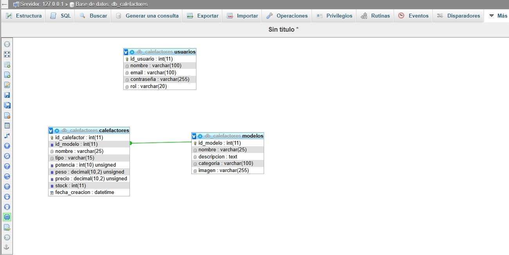

# db_calefactores

## Integrantes
- Pedro Colella (pedrocolella@gmail.com)
- Luciano Fiaschetti (luchinio_n@gmail.com)

## Temática 
Administración de calefactores.

## Descripción
El sistema brinda un catalogo de calefactores agrupandolos por modelos (1:n), 
facilitando el control de stock de mercaderia, y permite al usuario hacer consultas 
por modelos segun sus caracteristicas.

## DER 


---

## Entrega 2

DESCRIPCION BREVE:
Este proyecto es una aplicación web desarrollada en PHP que permite la 
visualizacion y administración de un catalogo de calefactores 
y sus respectivos modelos.

El sistema cuenta con dos entornos:
1. **Seccion Publica**: Navegacion por modelos y ficha tecnica de cada calefactor.
2. **Seccion de Administracion (Privada)**: Panel protegido por login donde los administradores 
   pueden realizar operaciones CRUD sobre modelos y calefactores.

CARACTERISTICAS TECNICAS:
* Arquitectura MVC en PHP.
* Conexion a base de datos MySQL mediante PDO y consultas preparadas.
* Autenticacion con contraseñas encriptadas.
* Gestion dinamica de imagenes de modelos.

---

## Despliegue y uso

Para ejecutar el proyecto en un servidor local con **Apache y MySQL**:

1. Copiar la carpeta `db_calefactores` dentro de `htdocs`.
2. Crear la base de datos
Antes de usar la aplicacion, asegurarse de que exista la base `db_calefactores`.

- Opcion rapida: en phpMyAdmin ejecutar:
  ```sql
  CREATE DATABASE db_calefactores;

- Las tablas se crean solas con la ejecucion de deploy

---

Usuario de prueba

### Usuarios de prueba 
Usuario: `webadmin`  
Contraseña: `admin`