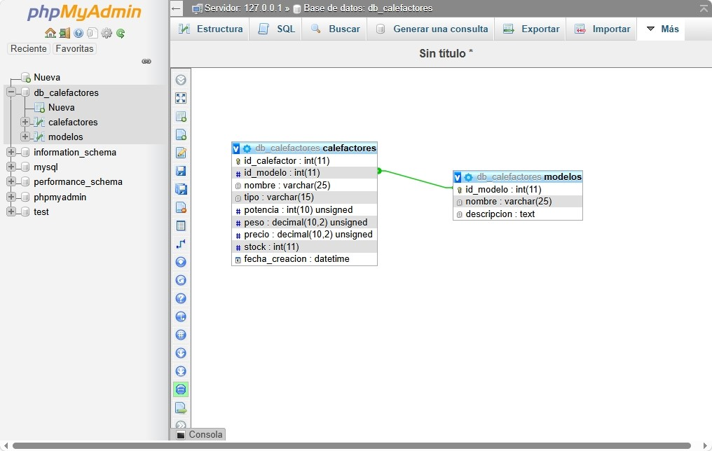

# db_calefactores

## Integrantes
- Pedro Colella (pedrocolella@gmail.com)
- Luciano Fiaschetti (luchinio_n@gmail.com)

## Temática 
Administración de calefactores.

## Descripción
El sistema brinda un catálogo de calefactores agrupándolos por modelos (1:n), facilitando el control de stock de mercadería, y permite al usuario hacer consultas por modelos según sus características.

## DER 

---

## Entrega 2

DESCRIPCIÓN BREVE:
Este proyecto es una aplicación web desarrollada en PHP que permite la 
visualización, filtrado y administración de un catálogo de calefactores 
y sus respectivos modelos.

... (resto de tu texto de entrega 2)